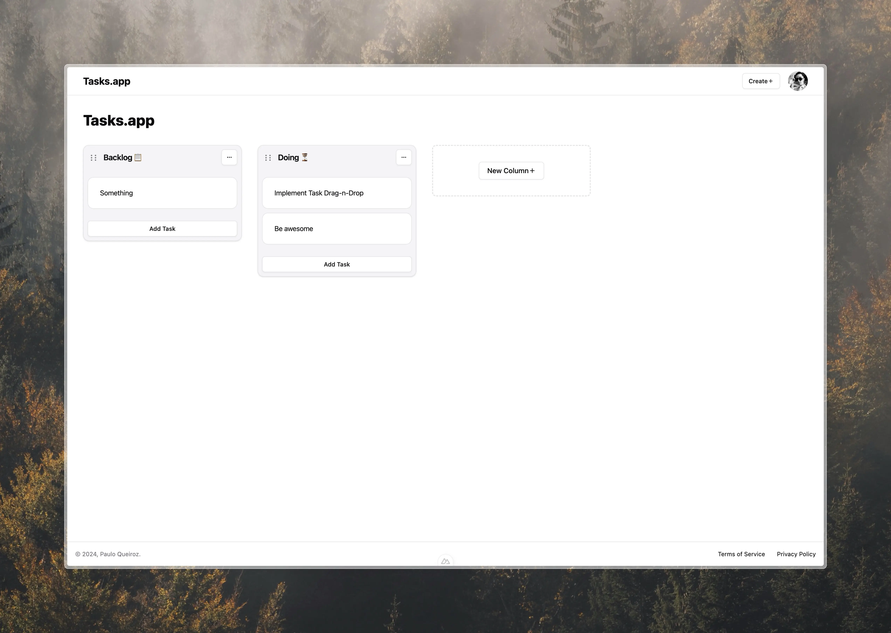

# Tasks.app

Tasks.app is a Trello clone I'm building as a project for my Software 
Engineering course at [Infnet](https://www.infnet.edu.br/infnet/home/). The 
project is being developed using the following technologies:

- [Nuxt.js](https://nuxt.com)
- [Nuxt Auth Utils](https://github.com/Atinux/nuxt-auth-utils) — OAuth
- [Uno.css](https://unocss.dev)
- [Drizzle ORM](https://orm.drizzle.team)
- PostgreSQL
- [Bun](https://bun.sh)
- Docker

The goal of this project is to re-implement a subset of Trello's features,
such as creating boards, lists, and cards, and moving cards between lists.

